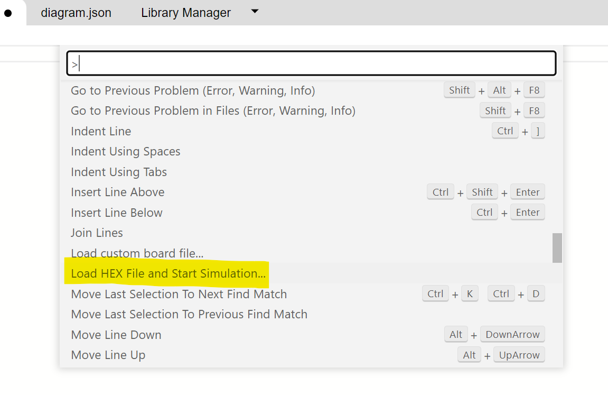
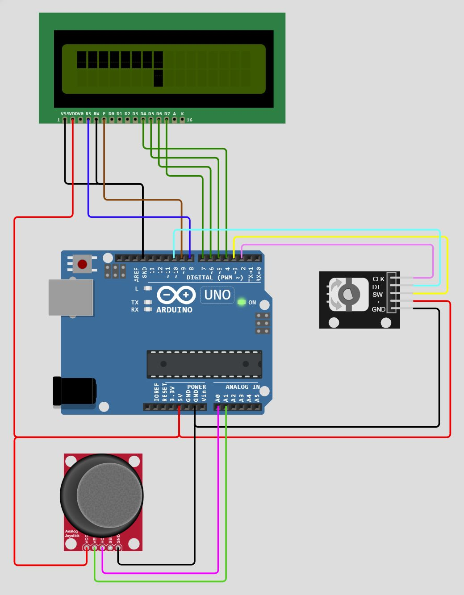

# Joystick-meter

# Overall presentation

The goal of this project is to display the position of a joystick with characters on an LCD screen.

The choice of character is made with the rotary encoder. By turning the rotary encoder, a list of characters is scrolled in one direction or the other depending on the direction of rotation applied.

The position of the joystick in each of the two directions is determined by two analog measurements operated by 2 ADC channels.

Each of the two channels is represented on a line of the screen, line 0 : X, line 1 : Y.

For practical reasons, the 16th character is not used.

When the joystick is in "neutral" position, only 1 character is displayed at position 7.

When you push the joystick to the right or up, you increase the number of characters displayed from position 7 to position 14.

Conversely, when the joystick is pushed to the left or down, the number of characters displayed before position 7 is increased, up to position 0.

When you press the rotary encoder's switch, you switch to a different mode with which you can change the update speed on the LCD screen.

# Examples of rendering

R = 0

478 &lt;= X &lt;= 546

478 &lt;= Y &lt;= 546

<table>
  <tr>
   <td>0
   </td>
   <td>1
   </td>
   <td>2
   </td>
   <td>3
   </td>
   <td>4
   </td>
   <td>5
   </td>
   <td>6
   </td>
   <td>7
   </td>
   <td>8
   </td>
   <td>9
   </td>
   <td>10
   </td>
   <td>11
   </td>
   <td>12
   </td>
   <td>13
   </td>
   <td>14
   </td>
   <td>15
   </td>
  </tr>
  <tr>
   <td> 
   </td>
   <td> 
   </td>
   <td> 
   </td>
   <td> 
   </td>
   <td> 
   </td>
   <td>
   </td>
   <td>
   </td>
   <td>◼️
   </td>
   <td>
   </td>
   <td>
   </td>
   <td> 
   </td>
   <td> 
   </td>
   <td> 
   </td>
   <td> 
   </td>
   <td> 
   </td>
   <td> 
   </td>
  </tr>
  <tr>
   <td> 
   </td>
   <td> 
   </td>
   <td> 
   </td>
   <td> 
   </td>
   <td> 
   </td>
   <td> 
   </td>
   <td> 
   </td>
   <td>◼️
   </td>
   <td>
   </td>
   <td>
   </td>
   <td>
   </td>
   <td>
   </td>
   <td>
   </td>
   <td> 
   </td>
   <td> 
   </td>
   <td> 
   </td>
  </tr>
</table>

 

R = 0

342 &lt;= X &lt;= 409

820 &lt;= Y &lt;= 887

<table>
  <tr>
   <td>0
   </td>
   <td>1
   </td>
   <td>2
   </td>
   <td>3
   </td>
   <td>4
   </td>
   <td>5
   </td>
   <td>6
   </td>
   <td>7
   </td>
   <td>8
   </td>
   <td>9
   </td>
   <td>10
   </td>
   <td>11
   </td>
   <td>12
   </td>
   <td>13
   </td>
   <td>14
   </td>
   <td>15
   </td>
  </tr>
  <tr>
   <td> 
   </td>
   <td> 
   </td>
   <td> 
   </td>
   <td> 
   </td>
   <td> 
   </td>
   <td>◼️
   </td>
   <td>◼️
   </td>
   <td>◼️
   </td>
   <td> 
   </td>
   <td> 
   </td>
   <td> 
   </td>
   <td> 
   </td>
   <td> 
   </td>
   <td> 
   </td>
   <td> 
   </td>
   <td> 
   </td>
  </tr>
  <tr>
   <td> 
   </td>
   <td> 
   </td>
   <td> 
   </td>
   <td> 
   </td>
   <td> 
   </td>
   <td> 
   </td>
   <td> 
   </td>
   <td>◼️
   </td>
   <td>◼️
   </td>
   <td>◼️
   </td>
   <td> ◼️
   </td>
   <td> ◼️
   </td>
   <td> ◼️
   </td>
   <td> 
   </td>
   <td> 
   </td>
   <td> 
   </td>
  </tr>
</table>

 

R = 4

751 &lt;= X &lt;= 819

0 &lt;= Y &lt;= 68

<table>
  <tr>
   <td>0
   </td>
   <td>1
   </td>
   <td>2
   </td>
   <td>3
   </td>
   <td>4
   </td>
   <td>5
   </td>
   <td>6
   </td>
   <td>7
   </td>
   <td>8
   </td>
   <td>9
   </td>
   <td>10
   </td>
   <td>11
   </td>
   <td>12
   </td>
   <td>13
   </td>
   <td>14
   </td>
   <td>15
   </td>
  </tr>
  <tr>
   <td><strong> </strong>
   </td>
   <td><strong> </strong>
   </td>
   <td><strong> </strong>
   </td>
   <td><strong> </strong>
   </td>
   <td><strong> </strong>
   </td>
   <td><strong> </strong>
   </td>
   <td><strong> </strong>
   </td>
   <td><strong>*</strong>
   </td>
   <td><strong> *</strong>
   </td>
   <td><strong>* </strong>
   </td>
   <td><strong>* </strong>
   </td>
   <td><strong> *</strong>
   </td>
   <td><strong> *</strong>
   </td>
   <td><strong>* </strong>
   </td>
   <td><strong> </strong>
   </td>
   <td> 
   </td>
  </tr>
  <tr>
   <td><strong> *</strong>
   </td>
   <td><strong> *</strong>
   </td>
   <td><strong> *</strong>
   </td>
   <td><strong> *</strong>
   </td>
   <td><strong> *</strong>
   </td>
   <td><strong> *</strong>
   </td>
   <td><strong> *</strong>
   </td>
   <td><strong>*</strong>
   </td>
   <td><strong> </strong>
   </td>
   <td><strong> </strong>
   </td>
   <td><strong> </strong>
   </td>
   <td><strong> </strong>
   </td>
   <td><strong> </strong>
   </td>
   <td><strong> </strong>
   </td>
   <td><strong> </strong>
   </td>
   <td> 
   </td>
  </tr>
</table>

# Implementation with Arduino Uno and platform.io

## Schematics

## Flowcharts

Flowchart of main function:

Flowchart of display_bars function:

Flowchart of get_mask_from_adc function:

Flowchart of interrupt service routine on ADC_vect:

Flowchart of interrupt service routine on TIMER1_OVF_vect:

Flowchart of interrupt service routine on INT0_vect:

Flowchart of interrupt service routine on INT1_vect:

## ADC value to pattern display table 

X : 0..1023

Y : 0..1023

1024 / 14 = 68.2

<table>
  <tr>
   <td><strong>inf</strong>
   </td>
   <td><strong>sup</strong>
   </td>
   <td><strong>Active positions</strong>
   </td>
   <td><strong>bit mask</strong>
   </td>
   <td><strong>bit mask in hex</strong>
   </td>
  </tr>
  <tr>
   <td>0
   </td>
   <td>68
   </td>
   <td>0, 1, 2, 3, 4, 5, 6, 7
   </td>
   <td><code>0000000011111111</code>
   </td>
   <td>0x00FF
   </td>
  </tr>
  <tr>
   <td>69
   </td>
   <td>136
   </td>
   <td>1, 2, 3, 4, 5, 6, 7
   </td>
   <td><code>0000000011111110</code>
   </td>
   <td>0x00FE
   </td>
  </tr>
  <tr>
   <td>137
   </td>
   <td>204
   </td>
   <td>2, 3, 4, 5, 6, 7
   </td>
   <td><code>0000000011111100</code>
   </td>
   <td>0x00FC
   </td>
  </tr>
  <tr>
   <td>205
   </td>
   <td>273
   </td>
   <td>3, 4, 5, 6, 7
   </td>
   <td><code>0000000011111000</code>
   </td>
   <td>0x00F8
   </td>
  </tr>
  <tr>
   <td>274
   </td>
   <td>341
   </td>
   <td>4, 5, 6, 7
   </td>
   <td><code>0000000011110000</code>
   </td>
   <td>0x00F0
   </td>
  </tr>
  <tr>
   <td>342
   </td>
   <td>409
   </td>
   <td>5, 6, 7
   </td>
   <td><code>0000000011100000</code>
   </td>
   <td>0x00E0
   </td>
  </tr>
  <tr>
   <td>410
   </td>
   <td>477
   </td>
   <td>6, 7
   </td>
   <td><code>0000000011000000</code>
   </td>
   <td>0x00C0
   </td>
  </tr>
  <tr>
   <td>478
   </td>
   <td>546
   </td>
   <td>7
   </td>
   <td><code>0000000010000000</code>
   </td>
   <td>0x0080
   </td>
  </tr>
  <tr>
   <td>547
   </td>
   <td>614
   </td>
   <td>7, 8
   </td>
   <td><code>0000000110000000</code>
   </td>
   <td>0x0180
   </td>
  </tr>
  <tr>
   <td>615
   </td>
   <td>682
   </td>
   <td>7, 8, 9
   </td>
   <td><code>0000001110000000</code>
   </td>
   <td>0x0380
   </td>
  </tr>
  <tr>
   <td>683
   </td>
   <td>750
   </td>
   <td>7, 8, 9, 10
   </td>
   <td><code>0000011110000000</code>
   </td>
   <td>0x0780
   </td>
  </tr>
  <tr>
   <td>751
   </td>
   <td>819
   </td>
   <td>7, 8, 9, 10, 11
   </td>
   <td><code>0000111110000000</code>
   </td>
   <td>0x0F80
   </td>
  </tr>
  <tr>
   <td>820
   </td>
   <td>887
   </td>
   <td>7, 8, 9, 10, 11, 12
   </td>
   <td><code>0001111110000000</code>
   </td>
   <td>0x1F80
   </td>
  </tr>
  <tr>
   <td>888
   </td>
   <td>955
   </td>
   <td>7, 8, 9, 10, 11, 12, 13
   </td>
   <td><code>0011111110000000</code>
   </td>
   <td>0x3F80
   </td>
  </tr>
  <tr>
   <td>956
   </td>
   <td>1024
   </td>
   <td>7, 8, 9, 10, 11, 12, 13, 14
   </td>
   <td><code>0111111110000000</code>
   </td>
   <td>0x7F80
   </td>
  </tr>
</table>

## Rotary encoder

Character according to the rotary encoder

R : 0..16

<table>
  <tr>
   <td>0
   </td>
   <td>◼️ (0xFF)
   </td>
  </tr>
  <tr>
   <td>1
   </td>
   <td>|
   </td>
  </tr>
  <tr>
   <td>2
   </td>
   <td>* 
   </td>
  </tr>
  <tr>
   <td>3
   </td>
   <td>$ 
   </td>
  </tr>
</table>

# Technical challenges encountered

## Global variables updated from an Interrupt Service Routine

At first, the reading in the main loop of some of the variables updated under interruption was not effective.

Indeed, by default, the code generated by the compiler places the contents of the variables in registers that are not affected by the changes made to these variables by operations under interruption.

By using the keyword ``volatile`` when declaring variables, the compiler generates a code that systematically rereads the contents of the memory. With this change, the problem has been solved.

## Interpreting the rotary encoder data signal 

When connecting the rotary encoder to the Arduino Uno we noticed that the reading of the encoder position was somewhat random, a single rotation notch could trigger several increments of the internal counter.

After some research, we understood that this is a problem of bouncing of the hardware signal generated by the rotation of the encoder.

This video shows the phenomenon in detail: https://www.youtube.com/watch?v=iwyARHUbvNI

The best answer to this problem would be to add hardware processing to make the signal clean. This page gives a detailed explanation on how to achieve this: https://perhof.wordpress.com/2012/11/01/using-rotary-encoders-with-arduino/.

It is also possible to filter the signal through the software, but this requires a development effort that was beyond the time allowed for this project, especially to access the hardware.

# Videos

1/2: [https://www.youtube.com/shorts/JRLk4Ib_5gE](https://www.youtube.com/shorts/JRLk4Ib_5gE)

2/2: [https://www.youtube.com/shorts/cbP7iCP0t4g](https://www.youtube.com/shorts/cbP7iCP0t4g)

# Online simulation and demonstration

The work done is fully testable online at wowki.com, a simuator which we used to test our program during the development.

Here are the different steps to follow:
- open the page [https://wokwi.com/projects/350154241019478612](https://wokwi.com/projects/350154241019478612)
  or  [https://wokwi.com/projects/349521167663497812](https://wokwi.com/projects/349521167663497812) where we replaced the proposed joystick by two linear potentiometers to overcome its limitations. 
- load the file [firmware.hex](firmware.hex) after pressing "F1" when the cursor is placed in the editor on the left of the screen.
- press the "play" button.

